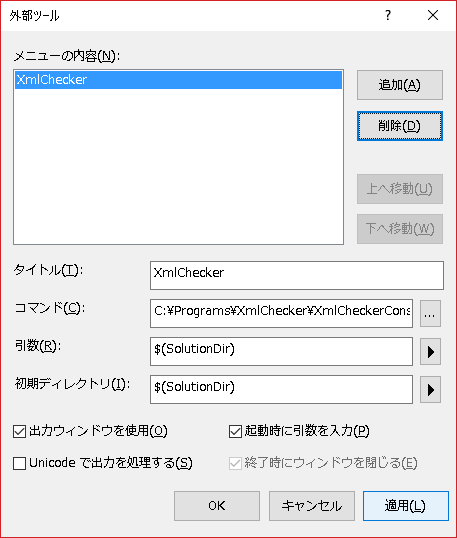

# XmlChecker
XMLをチェックするためのツール。

## 使い方
２通りの使い方ができます。

1. コマンドラインツール
2. MSBuildタスク

### コマンドラインツールの使い方
XmlCheckerConsole.exe がコマンドラインツールです。 
以下のようにして使用できます。

> XmlCheckerConsole.exe [target]

"target" にはディレクトリまたはファイルのパスを指定します。
ディレクトリが指定された場合、現行バージョンではディレクトリ配下のすべてのxamlファイルをチェック対象とします。

Visual Studioからは下図のように外部ツールとして登録して使用すると便利です。  

### MSBuildタスクの使い方
XmlCheckTask が MSBuild として定義してあります。 
使用できるパラメータは以下の通りです。

パラメータ|説明
---|---
TargetFiles|チェック対象とするファイルを指定します。コマンドラインツールとは異なり、ディレクトリを指定しても機能しません。
RuleFiles|CSVで記述されたルールファイルを指定します。
ErrorLevels|エラーとして扱うレベルを指定します。レベルはルールファイルで記述します。詳しくは、ルールの記述方法を参照してください。

"XmlChecker.targets" ファイルがMSBuildタスクのサンプルとなります。
このファイルはnugetパッケージ内で使用されています。
